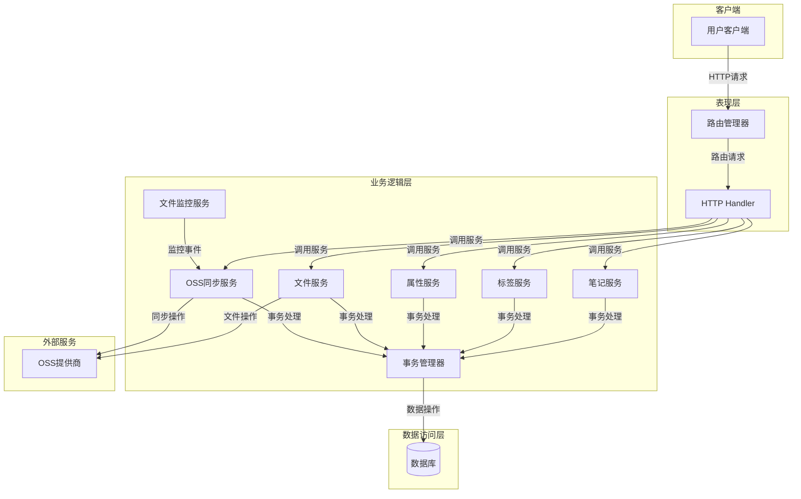
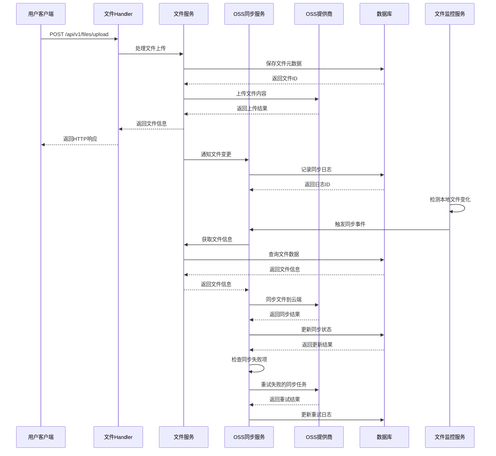
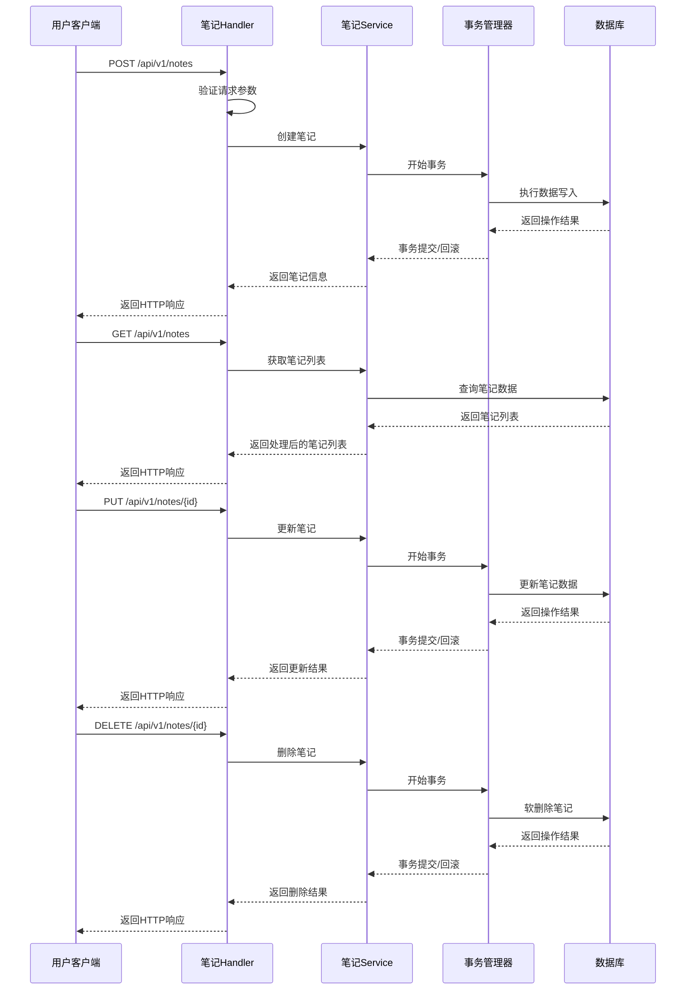
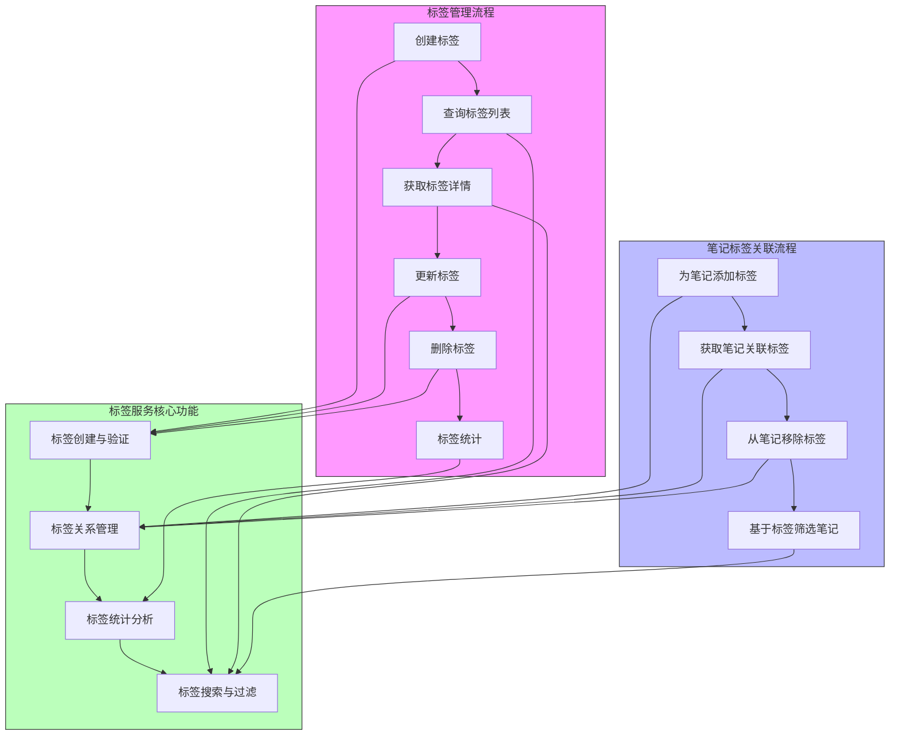

# Scinote Go Client

一个功能完整的基于Go语言和Gin框架的笔记与文件管理系统，提供笔记管理、文件上传下载、多云存储同步、文件监控等企业级功能。

## 📝 项目简介

Scinote Go Client是一个高性能、可扩展的笔记与文件管理平台，专为个人和团队协作设计。系统不仅支持完整的文件管理功能，还提供了强大的笔记管理、标签系统和属性系统，帮助用户更高效地组织和检索知识资产。

## ✨ 项目亮点

- **事务处理优化**：所有核心业务操作均采用数据库事务管理，确保数据一致性和完整性
- **模块化架构**：清晰的三层架构设计，易于扩展和维护
- **多云存储集成**：支持多种云存储服务，实现数据备份和高可用性
- **实时文件监控**：自动检测文件变化并触发同步操作
- **完整的笔记生态**：笔记创建、编辑、标签、属性等功能一应俱全
- **全面的API文档**：提供Swagger文档，方便集成和测试

## 🚀 功能特性

### 核心功能
- **笔记管理系统**: 完整的笔记创建、编辑、删除、搜索功能
- **标签系统**: 为笔记添加标签，支持多标签管理和标签统计
- **属性系统**: 为笔记添加自定义属性，支持属性查询和过滤
- **文件管理系统**: 完整的文件上传、下载、删除、搜索功能
- **多云存储支持**: 支持阿里云OSS、腾讯云COS、七牛云Kodo
- **文件同步服务**: 本地与云存储的双向同步
- **文件监控**: 实时监控文件变化并自动同步
- **配置管理**: 灵活的OSS配置管理系统

### 技术特性
- **RESTful API设计**: 标准化的API接口
- **Swagger文档**: 完整的API文档支持
- **中间件支持**: 日志、CORS、认证等中间件
- **数据库支持**: SQLite/MySQL数据库支持（使用GORM）
- **优雅关闭**: 支持服务优雅关闭
- **健康检查**: 完整的服务健康检查机制

## 🛠 技术栈

- **后端框架**: Go 1.21+ + Gin Web框架
- **ORM框架**: GORM
- **数据库**: SQLite/MySQL
- **配置管理**: Viper
- **日志系统**: Logrus
- **文档系统**: Swagger/OpenAPI
- **云存储SDK**: 阿里云OSS、腾讯云COS、七牛云Kodo官方SDK

## 📁 项目结构

```
scinote-go-client/
├── config.toml              # 配置文件
├── go.mod                   # Go模块文件
├── main.go                  # 主程序入口
├── README.md                # 项目说明
├── Makefile                 # 构建脚本
├── Dockerfile               # Docker构建文件
├── docker-compose.yml       # Docker Compose配置
├── .gitignore               # Git忽略文件
├── config/                  # 配置包
│   └── config.go           # 配置结构定义
├── docs/                    # API文档
│   ├── docs.go             # Swagger文档生成
│   ├── swagger.json        # Swagger JSON
│   └── swagger.yaml        # Swagger YAML
├── examples/                # 示例文件
│   └── api_test.http       # API测试示例
└── internal/                # 内部包
    ├── database/           # 数据库相关
    │   ├── database.go     # 数据库连接
    │   └── models.go       # 数据模型
    ├── handler/            # HTTP处理器
    │   ├── file_handler.go # 文件管理处理器
    │   └── oss_handler.go  # OSS管理处理器
    ├── middleware/         # 中间件
    │   └── logger_middleware.go # 日志中间件
    ├── router/             # 路由配置
    │   └── router.go       # 路由定义
    └── service/            # 业务逻辑层
        ├── file_service.go         # 文件服务
        ├── file_watcher_service.go # 文件监控服务
        ├── note_service.go         # 笔记服务
        ├── tag_service.go          # 标签服务
        ├── property_service.go     # 属性服务
        ├── oss_aliyun.go          # 阿里云OSS实现
        ├── oss_config_service.go  # OSS配置服务
        ├── oss_interface.go       # OSS接口定义
        ├── oss_qiniu.go           # 七牛云实现
        ├── oss_sync_service.go    # OSS同步服务
        └── oss_tencent.go         # 腾讯云COS实现
```

## 🚀 快速开始

### 1. 环境要求

- Go 1.21+
- SQLite3 (或 MySQL)
- 云存储账号 (可选，用于OSS功能)

### 2. 安装依赖

```bash
# 克隆项目
git clone <repository-url>
cd scinote-go-client

# 安装依赖
go mod tidy
```

### 3. 配置文件

复制并修改配置文件：

```bash
cp config.toml.example config.toml
```

根据需要修改配置文件中的数据库连接、服务端口等配置。

### 4. 运行服务

```bash
# 开发模式运行
go run main.go

# 或使用Makefile
make run
```

服务将在 `http://localhost:8080` 启动

### 5. 访问API文档

启动服务后，访问 Swagger API 文档：

```
http://localhost:8080/swagger/index.html
```

### 6. 基础接口测试

```bash
# 健康检查
curl http://localhost:8080/health

# 服务信息
curl http://localhost:8080/api/v1/info

# 数据库状态检查
curl http://localhost:8080/api/v1/db/status
```

## 📚 API接口文档

### 基础接口

- `GET /health` - 健康检查
- `GET /api/v1/info` - 服务信息
- `GET /api/v1/db/status` - 数据库状态检查
- `GET /swagger/index.html` - API文档

### 笔记管理接口

#### 笔记操作
- `POST /api/v1/notes` - 创建笔记
- `GET /api/v1/notes/:id` - 获取笔记详情
- `PUT /api/v1/notes/:id` - 更新笔记
- `DELETE /api/v1/notes/:id` - 删除笔记
- `GET /api/v1/notes` - 获取笔记列表
- `GET /api/v1/notes/search` - 搜索笔记

#### 标签管理
- `POST /api/v1/notes/:id/tags` - 为笔记添加标签
- `GET /api/v1/notes/:id/tags` - 获取笔记标签
- `DELETE /api/v1/notes/:id/tags/:tag_id` - 删除笔记标签
- `GET /api/v1/tags` - 获取所有标签
- `GET /api/v1/tags/stats` - 获取标签统计

#### 属性管理
- `POST /api/v1/notes/:id/properties` - 为笔记添加属性
- `GET /api/v1/notes/:id/properties` - 获取笔记属性
- `PUT /api/v1/notes/:id/properties/:property_id` - 更新笔记属性
- `DELETE /api/v1/notes/:id/properties/:property_id` - 删除笔记属性

### 文件管理接口

#### 文件操作
- `POST /api/v1/files/upload` - 上传文件
- `GET /api/v1/files/:id` - 获取文件信息
- `GET /api/v1/files/:id/download` - 下载文件
- `PUT /api/v1/files/:id` - 更新文件
- `DELETE /api/v1/files/:id` - 删除文件

#### 文件查询
- `GET /api/v1/files` - 文件列表
- `GET /api/v1/files/search` - 搜索文件
- `GET /api/v1/files/stats` - 文件统计

### OSS管理接口

#### OSS配置管理
- `POST /oss/configs` - 创建OSS配置
- `GET /oss/configs` - 获取OSS配置列表
- `GET /oss/configs/:id` - 获取指定OSS配置
- `PUT /oss/configs/:id` - 更新OSS配置
- `DELETE /oss/configs/:id` - 删除OSS配置
- `POST /oss/configs/:id/activate` - 激活OSS配置
- `POST /oss/configs/:id/test` - 测试OSS配置
- `GET /oss/configs/active` - 获取当前激活的OSS配置
- `POST /oss/configs/:id/toggle` - 切换OSS配置状态

#### OSS同步管理
- `POST /oss/sync/all` - 从OSS同步所有文件
- `POST /oss/sync/scan` - 扫描并比较文件
- `GET /oss/sync/logs` - 获取同步日志
- `GET /oss/sync/status/:file_id` - 获取文件同步状态
- `POST /oss/sync/retry/:log_id` - 重试失败的同步
- `POST /oss/sync/file/:file_id` - 同步单个文件到OSS
- `POST /oss/sync/batch` - 批量同步文件到OSS

## ⚙️ 配置说明

配置文件 `config.toml` 包含以下配置项：

### 服务器配置
```toml
[server]
port = 8080
read_timeout = "30s"
write_timeout = "30s"
idle_timeout = "60s"
```

### 数据库配置
```toml
[database]
driver = "sqlite"
dsn = "./data/scinote.db"
max_open_conns = 10
max_idle_conns = 5
conn_max_lifetime = "1h"
```

### 日志配置
```toml
[log]
level = "info"
format = "json"
output = "stdout"
```

### CORS配置
```toml
[cors]
allowed_origins = ["*"]
allowed_methods = ["GET", "POST", "PUT", "DELETE", "OPTIONS"]
allowed_headers = ["*"]
```

### 文件存储配置
```toml
[storage]
local_path = "./uploads"
max_file_size = "100MB"
allowed_extensions = [".jpg", ".png", ".pdf", ".doc", ".docx"]
```

## 🏗️ 架构设计

### 分层架构

项目采用经典的三层架构设计：

1. **Handler层** (`internal/handler/`): HTTP请求处理，参数验证，响应格式化
2. **Service层** (`internal/service/`): 业务逻辑处理，核心功能实现
3. **Database层** (`internal/database/`): 数据持久化，模型定义

> **提示**: 文档中的流程图使用Mermaid语法绘制，需要在支持Mermaid的Markdown查看器中才能正确显示。建议使用GitHub、VS Code的Markdown Preview Enhanced插件或其他支持Mermaid的工具查看。

### 系统架构流程图



### Service层详细介绍

#### 1. 笔记服务 (note_service.go)

**NoteService接口**提供完整的笔记管理功能：

```go
// NoteService 定义笔记服务接口
type NoteService interface {
    // 笔记基础操作
    CreateNote(title, content string) (*database.Note, error)
    GetNote(id uint) (*database.Note, error)
    UpdateNote(id uint, title, content string) (*database.Note, error)
    DeleteNote(id uint) error
    ListNotes(page, pageSize int, filters map[string]interface{}) ([]*database.Note, int64, error)
    SearchNotes(query string, page, pageSize int) ([]*database.Note, int64, error)
    
    // 标签相关操作
    AddNoteTag(noteID, tagID uint) error
    RemoveNoteTag(noteID, tagID uint) error
    GetNoteTags(noteID uint) ([]*database.Tag, error)
    
    // 属性相关操作
    SetNoteProperty(noteID uint, key, value string) error
    GetNoteProperties(noteID uint) ([]*database.NoteProperty, error)
}```

**主要功能**：
- 笔记的创建、读取、更新和删除
- 笔记搜索和分页查询
- 笔记标签管理
- 笔记属性管理
- 事务管理，确保数据一致性

#### 2. 标签服务 (tag_service.go)

**TagService接口**提供标签管理功能：

```go
// TagService 定义标签服务接口
type TagService interface {
    CreateTag(name string) (*database.Tag, error)
    GetTag(id uint) (*database.Tag, error)
    GetTagByName(name string) (*database.Tag, error)
    ListTags() ([]*database.Tag, error)
    DeleteTag(id uint) error
    GetTagStats() ([]*TagStat, error)
}```

**主要功能**：
- 标签的创建和管理
- 标签查询和统计
- 标签与笔记的关联管理
- 标签使用频率统计

#### 3. 属性服务 (property_service.go)

**PropertyService接口**提供笔记属性管理功能：

```go
// PropertyService 定义属性服务接口
type PropertyService interface {
    CreateProperty(noteID uint, key, value string) (*database.NoteProperty, error)
    GetProperty(id uint) (*database.NoteProperty, error)
    UpdateProperty(id uint, key, value string) (*database.NoteProperty, error)
    DeleteProperty(id uint) error
    GetPropertiesByNoteID(noteID uint) ([]*database.NoteProperty, error)
    SearchByProperty(key, value string) ([]*database.Note, error)
}```

**主要功能**：
- 笔记属性的CRUD操作
- 属性查询和过滤
- 根据属性搜索笔记
- 属性值的验证和处理

#### 4. 文件服务 (file_service.go)

**FileService接口**提供完整的文件管理功能：

```go
type FileService interface {
    // 文件基础操作
    SaveFile(filename string, content io.Reader) (*database.File, error)
    GetFile(id uint) (*database.File, error)
    GetFileContent(id uint) (io.ReadCloser, error)
    DeleteFile(id uint) error
    UpdateFile(id uint, updates map[string]interface{}) error
    
    // 文件查询
    ListFiles(page, pageSize int, filters map[string]interface{}) ([]*database.File, int64, error)
    SearchFiles(query string, page, pageSize int) ([]*database.File, int64, error)
    GetFileStats() (*FileStats, error)
}
```

**主要功能**：
- 文件上传与存储管理
- 文件元数据管理
- 文件内容读取与下载
- 文件搜索与分页查询
- 文件统计信息

#### 2. 文件监控服务 (file_watcher_service.go)

**FileWatcherService接口**提供文件系统监控功能：

```go
type FileWatcherService interface {
    StartWatching(path string) error
    StopWatching() error
    AddWatchPath(path string) error
    RemoveWatchPath(path string) error
    GetWatchedPaths() []string
    IsWatching() bool
}
```

**主要功能**：
- 实时监控文件系统变化
- 支持多路径监控
- 文件变化事件处理
- 自动触发同步操作

#### 3. OSS接口定义 (oss_interface.go)

**OSSProvider接口**定义了统一的对象存储操作标准：

```go
type OSSProvider interface {
    UploadFile(objectKey string, reader io.Reader, contentType string) error
    DownloadFile(objectKey string) (io.ReadCloser, error)
    DeleteFile(objectKey string) error
    FileExists(objectKey string) (bool, error)
    GetFileInfo(objectKey string) (*FileInfo, error)
    ListFiles(prefix string, maxKeys int) ([]FileInfo, error)
    TestConnection() error
}
```

**设计特点**：
- 统一的接口抽象，支持多种云存储提供商
- 工厂模式创建不同的OSS实例
- 标准化的文件操作接口

#### 4. OSS配置服务 (oss_config_service.go)

**OSSConfigService接口**管理OSS配置：

```go
type OSSConfigService interface {
    CreateOSSConfig(config *database.OSSConfig) error
    GetOSSConfig(id uint) (*database.OSSConfig, error)
    ListOSSConfigs() ([]*database.OSSConfig, error)
    UpdateOSSConfig(id uint, updates map[string]interface{}) error
    DeleteOSSConfig(id uint) error
    ActivateOSSConfig(id uint) error
    GetActiveOSSConfig() (*database.OSSConfig, error)
    TestOSSConfig(id uint) error
    ToggleOSSConfig(id uint, enabled bool) error
}
```

**主要功能**：
- OSS配置的CRUD操作
- 配置激活与切换
- 连接测试与验证
- 配置状态管理

#### 5. OSS同步服务 (oss_sync_service.go)

**OSSyncService接口**提供文件同步功能：

```go
type OSSyncService interface {
    // 同步操作
    SyncToOSS(fileID uint) error
    SyncFromOSS(objectKey string, localPath string) error
    BatchSyncToOSS(fileIDs []uint) error
    SyncAllFromOSS() error
    
    // 文件比较与扫描
    ScanAndCompareFiles() (*ScanResult, error)
    
    // 同步日志管理
    GetSyncLogs(page, pageSize int, filters map[string]interface{}) ([]*database.SyncLog, int64, error)
    GetFileSyncStatus(fileID uint) (*database.SyncLog, error)
    RetryFailedSync(logID uint) error
}
```

**主要功能**：
- 本地文件到OSS的上传同步
- OSS文件到本地的下载同步
- 批量同步操作
- 文件差异扫描与比较
- 同步日志记录与管理
- 失败同步的重试机制

### 文件上传与同步时序图



#### 6. 云存储提供商实现

**阿里云OSS (oss_aliyun.go)**：
- 基于阿里云OSS SDK实现
- 支持分片上传、断点续传
- 完整的错误处理和重试机制

**腾讯云COS (oss_tencent.go)**：
- 基于腾讯云COS SDK实现
- 支持多地域配置
- 完整的权限管理

**七牛云Kodo (oss_qiniu.go)**：
- 基于七牛云SDK实现
- 支持CDN加速
- 灵活的存储策略

### 设计模式应用

1. **接口隔离原则**: 每个服务都定义了清晰的接口
2. **依赖注入**: 通过构造函数注入依赖
3. **工厂模式**: OSS提供商的创建使用工厂模式
4. **策略模式**: 不同的OSS提供商实现相同的接口
5. **观察者模式**: 文件监控服务的事件处理

### 笔记服务主要操作时序图



## 🗄️ 数据模型

### 核心数据模型

#### 1. 笔记模型 (Note)

```go
// Note 表示系统中的笔记实体

type Note struct {
    ID          uint      `gorm:"primaryKey" json:"id"`
    Title       string    `json:"title" binding:"required,min=1,max=255"`
    Content     string    `json:"content"`
    CreatedAt   time.Time `json:"created_at"`
    UpdatedAt   time.Time `json:"updated_at"`
    DeletedAt   gorm.DeletedAt `gorm:"index" json:"-"`
    
    // 关联关系
    Tags        []Tag          `gorm:"many2many:note_tags;foreignKey:ID;references:ID" json:"tags,omitempty"`
    Properties  []NoteProperty `gorm:"foreignKey:NoteID" json:"properties,omitempty"`
}
```

#### 2. 标签模型 (Tag)

```go
// Tag 表示笔记的标签实体

type Tag struct {
    ID        uint      `gorm:"primaryKey" json:"id"`
    Name      string    `gorm:"uniqueIndex" json:"name" binding:"required,min=1,max=50"`
    CreatedAt time.Time `json:"created_at"`
    UpdatedAt time.Time `json:"updated_at"`
    
    // 关联关系
    Notes     []Note    `gorm:"many2many:note_tags;foreignKey:ID;references:ID" json:"notes,omitempty"`
    UsageCount int       `gorm:"-:all" json:"usage_count"` // 非数据库字段，用于统计
}
```

#### 3. 笔记属性模型 (NoteProperty)

```go
// NoteProperty 表示笔记的扩展属性

type NoteProperty struct {
    ID        uint      `gorm:"primaryKey" json:"id"`
    NoteID    uint      `gorm:"index" json:"note_id"`
    Key       string    `json:"key" binding:"required,min=1,max=50"`
    Value     string    `json:"value" binding:"required,max=255"`
    CreatedAt time.Time `json:"created_at"`
    UpdatedAt time.Time `json:"updated_at"`
    
    // 关联关系
    Note      Note      `gorm:"foreignKey:NoteID" json:"note,omitempty"`
}
```

#### 4. 笔记-标签关联表 (note_tags)

```go
// 笔记和标签之间是多对多关系，通过中间表关联
// GORM会自动创建和管理此表
```

### 数据关系

- **笔记与标签**：多对多关系 (一个笔记可以有多个标签，一个标签可以属于多个笔记)
- **笔记与属性**：一对多关系 (一个笔记可以有多个属性)

### 标签系统操作流程图



## 🔧 开发指南

### 添加新的API接口

1. 在 `internal/service/` 中定义业务逻辑
2. 在 `internal/handler/` 中添加HTTP处理器
3. 在 `internal/router/` 中注册路由
4. 添加Swagger注释

### 添加新的OSS提供商

1. 实现 `OSSProvider` 接口
2. 在 `OSSProviderFactory` 中添加创建逻辑
3. 添加相应的配置结构

### 数据库操作

项目使用GORM作为ORM框架，支持SQLite和MySQL数据库：

```go
// 获取数据库连接
db := database.GetDB()

// 执行查询
var files []database.File
db.Where("status = ?", "active").Find(&files)
```

## 🚀 部署指南

### 使用Makefile

```bash
# 查看所有可用命令
make help

# 安装依赖
make deps

# 运行测试
make test

# 构建应用
make build

# 运行应用
make run

# 清理构建文件
make clean
```

### 使用Docker

```bash
# 构建并运行
docker-compose up --build

# 后台运行
docker-compose up -d

# 查看日志
docker-compose logs -f

# 停止服务
docker-compose down
```

### 生产环境部署

```bash
# 构建生产版本
CGO_ENABLED=0 GOOS=linux go build -a -installsuffix cgo -o scinote main.go

# 使用systemd管理服务
sudo cp scinote.service /etc/systemd/system/
sudo systemctl enable scinote
sudo systemctl start scinote
```

### 环境变量配置

```bash
# 数据库配置
export DB_DRIVER=mysql
export DB_DSN="user:password@tcp(localhost:3306)/scinote?charset=utf8mb4&parseTime=True&loc=Local"

# 服务配置
export SERVER_PORT=8080
export LOG_LEVEL=info

# OSS配置（可选）
export ALIYUN_ACCESS_KEY_ID=your_access_key
export ALIYUN_ACCESS_KEY_SECRET=your_secret_key
```

## 🧪 测试

### 运行测试

```bash
# 运行所有测试
go test ./...

# 运行特定包的测试
go test ./internal/service/

# 运行测试并生成覆盖率报告
go test -coverprofile=coverage.out ./...
go tool cover -html=coverage.out
```

### API测试

使用 `examples/api_test.http` 文件进行API测试，或使用curl：

#### 笔记管理测试

```bash
# 创建笔记
curl -X POST -H "Content-Type: application/json" \
  -d '{"title":"测试笔记","content":"这是一个测试笔记的内容"}' \
  http://localhost:8080/api/v1/notes

# 获取笔记列表
curl http://localhost:8080/api/v1/notes

# 获取笔记详情（替换{note_id}为实际ID）
curl http://localhost:8080/api/v1/notes/{note_id}

# 更新笔记
curl -X PUT -H "Content-Type: application/json" \
  -d '{"title":"更新后的标题","content":"更新后的内容"}' \
  http://localhost:8080/api/v1/notes/{note_id}

# 搜索笔记
curl "http://localhost:8080/api/v1/notes/search?query=测试"
```

#### 标签管理测试

```bash
# 为笔记添加标签
curl -X POST -H "Content-Type: application/json" \
  -d '{"tag_id":1}' \
  http://localhost:8080/api/v1/notes/{note_id}/tags

# 获取笔记标签
curl http://localhost:8080/api/v1/notes/{note_id}/tags

# 删除笔记标签
curl -X DELETE http://localhost:8080/api/v1/notes/{note_id}/tags/{tag_id}

# 获取所有标签
curl http://localhost:8080/api/v1/tags
```

#### 属性管理测试

```bash
# 为笔记添加属性
curl -X POST -H "Content-Type: application/json" \
  -d '{"key":"category","value":"技术笔记"}' \
  http://localhost:8080/api/v1/notes/{note_id}/properties

# 获取笔记属性
curl http://localhost:8080/api/v1/notes/{note_id}/properties
```

#### 文件管理测试

```bash
# 上传文件
curl -X POST -F "file=@test.txt" http://localhost:8080/api/v1/files/upload

# 获取文件列表
curl http://localhost:8080/api/v1/files

# 创建OSS配置
curl -X POST -H "Content-Type: application/json" \
  -d '{"name":"test","provider":"aliyun","access_key":"key","secret_key":"secret"}' \
  http://localhost:8080/oss/configs
```

## 🤝 贡献指南

1. Fork 本项目到您的GitHub账户
2. 创建特性分支 (`git checkout -b feature/新功能名称`)
3. 提交您的更改 (`git commit -m '添加某某新功能'`)
4. 推送到您的分支 (`git push origin feature/新功能名称`)
5. 创建 Pull Request 到主分支

### 代码规范

- 使用 `gofmt` 格式化代码
- 遵循 Go 官方编码规范
- 添加必要的注释和文档
- 编写单元测试
- 更新API文档

## 📝 更新日志

### v1.1.0 (2024-02-15)
- ✨ 新增笔记管理系统，支持笔记的创建、编辑、删除和搜索
- 🏷️ 新增标签系统，支持为笔记添加标签，以及标签管理和统计
- 📋 新增属性系统，支持为笔记添加自定义属性
- 🔧 事务处理优化，为所有核心业务操作添加数据库事务支持
- 📈 性能优化，提高并发处理能力
- 📝 完善API文档和使用说明

### v1.0.0 (2024-01-20)
- 🎉 初始版本发布
- ✅ 完整的文件管理功能（上传、下载、删除、搜索）
- ☁️ 多云存储支持（阿里云OSS、腾讯云COS、七牛云Kodo）
- 🔄 文件同步服务（本地与云端双向同步）
- 📊 文件监控服务（实时监控文件变化）
- 📚 完整的Swagger API文档支持
- 🏗️ 企业级架构设计（三层架构、设计模式应用）

## 🆘 常见问题

### Q: 如何配置多个OSS提供商？
A: 可以通过API创建多个OSS配置，并通过激活接口切换当前使用的配置。

### Q: 文件同步失败怎么办？
A: 可以通过同步日志接口查看失败原因，并使用重试接口重新同步。

### Q: 如何监控服务状态？
A: 使用健康检查接口 `/health` 和数据库状态检查接口 `/api/v1/db/status`。

## 📄 许可证

MIT License - 详见 [LICENSE](LICENSE) 文件

## 📞 联系方式

- 项目主页: [https://github.com/weiwangfds/scinote-go-client](https://github.com/weiwangfds/scinote-go-client)
- 问题反馈: [https://github.com/weiwangfds/scinote-go-client/issues](https://github.com/weiwangfds/scinote-go-client/issues)
- 邮箱: weiwangfds@163.com

---

**感谢使用 Scinote Go Client！** 🎉
